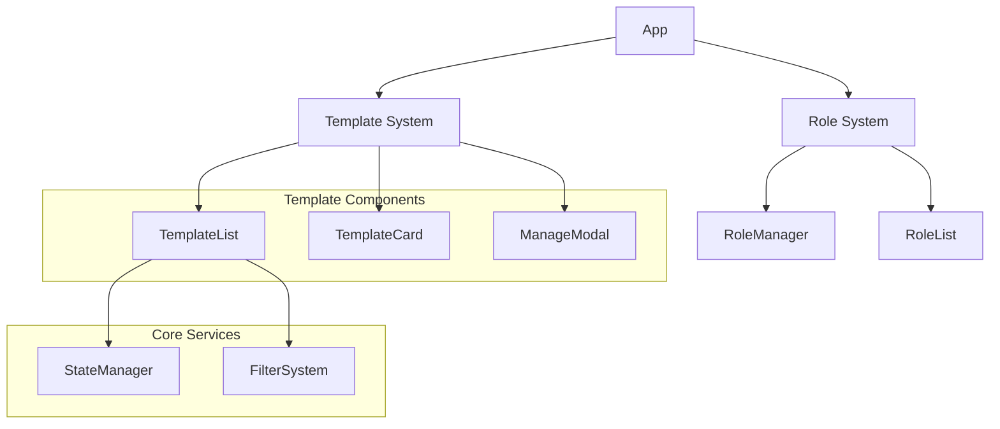
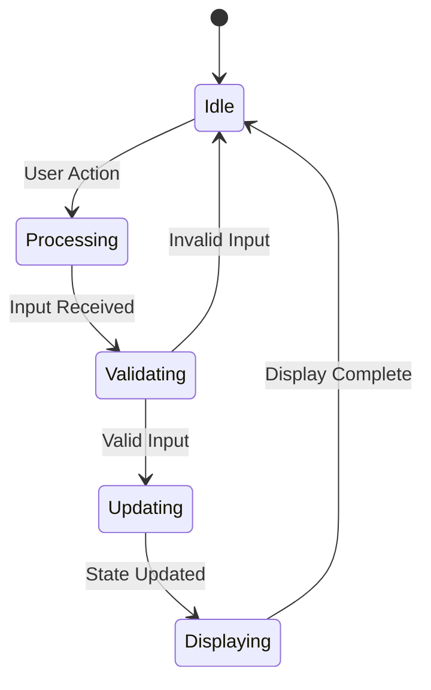
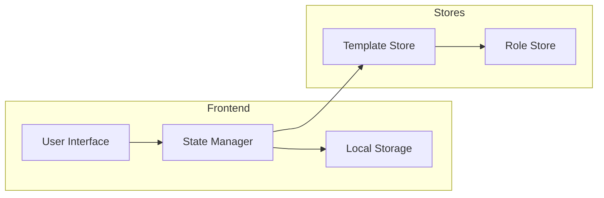
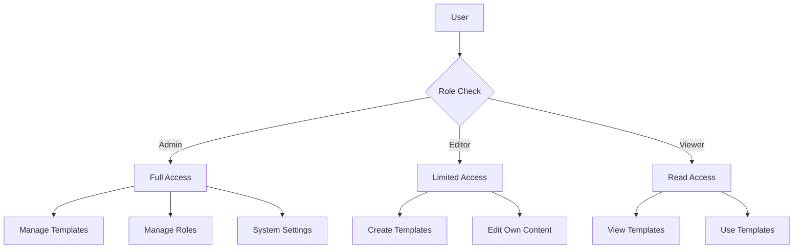
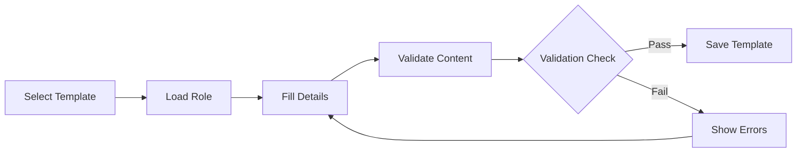
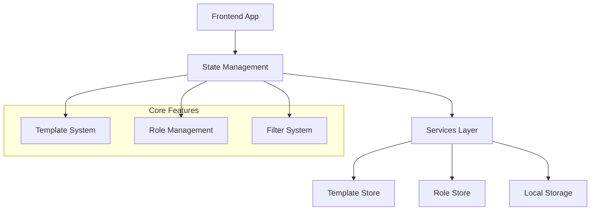
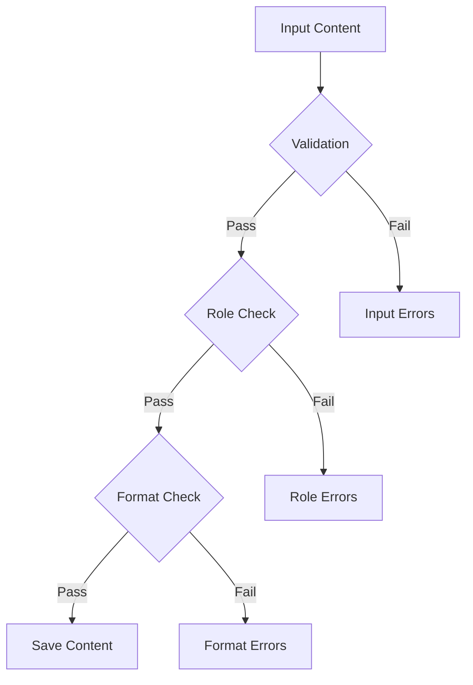
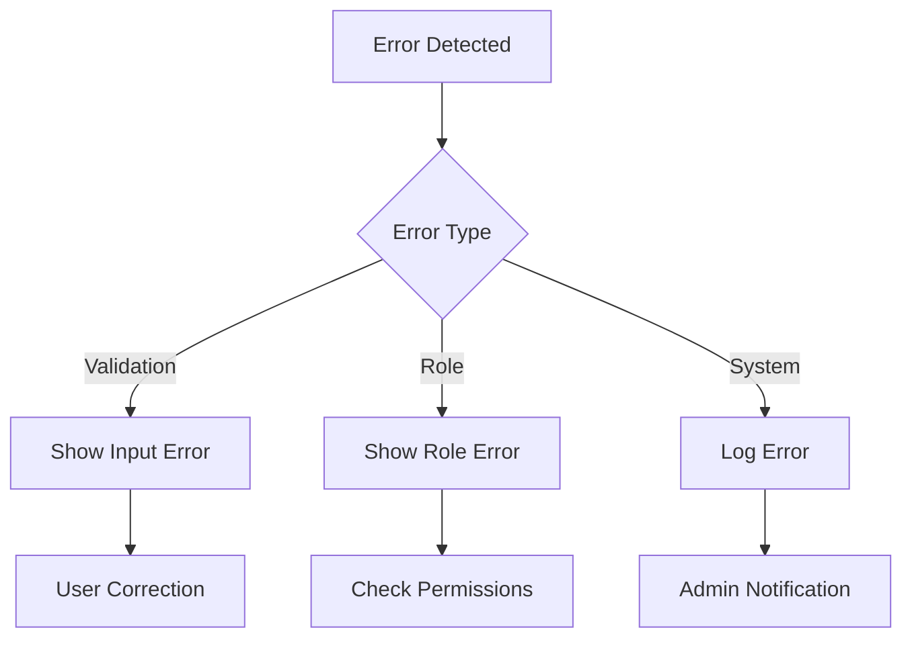
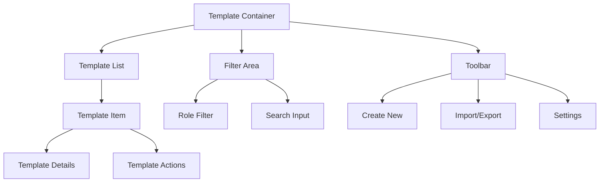
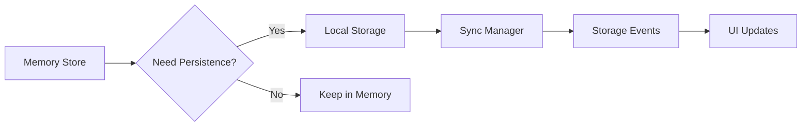

# System Diagrams

## Table of Contents
1. [Component Architecture](#1-component-architecture)
2. [State Management Flow](#2-state-management-flow)
3. [Data Flow Architecture](#3-data-flow-architecture)
4. [Role-Based Access Control](#4-role-based-access-control)
5. [Template Processing Flow](#5-template-processing-flow)
6. [System Integration Architecture](#6-system-integration-architecture)
7. [Compliance Validation Process](#7-compliance-validation-process)
8. [Development Examples](#8-development-examples)
9. [Specialized Diagrams](#9-specialized-diagrams)

## 1. Component Architecture

### Description
The component architecture diagram shows the hierarchical relationship between different parts of the system. It demonstrates how the Template System and Role System are organized, and how they interact with core services.

### Mermaid Graph


## 2. State Management Flow

### Description
The state management flow diagram illustrates how data flows through the application, ensuring proper state updates and UI synchronization.

### Mermaid State Diagram


## 3. Data Flow Architecture

### Description
The data flow architecture diagram shows how data moves through different layers of the application, demonstrating the separation between components and how data is managed and persisted.

### Mermaid Graph


## 4. Role-Based Access Control

### Description
The role-based access control system defines different user roles and their corresponding permissions.

### Mermaid Graph


## 5. Template Processing Flow



## 6. System Integration Architecture



## 7. Compliance Validation Process



## 8. Development Examples

### Using the Template Flow
```typescript
// Example implementation of Template Flow
class TemplateController {
  async processTemplate(template: Template): Promise<void> {
    // Validation
    const isValid = await this.validator.validate(template);
    if (!isValid) return;

    // State Update
    this.stateManager.updateState({
      status: 'processing',
      template
    });

    // Store Update
    await this.templateStore.saveTemplate(template);

    // Update UI
    this.updateInterface();
  }
}
```

### Implementing State Management
```typescript
// Example of State Management implementation
const useTemplateStore = create<TemplateState>((set) => ({
  status: 'idle',
  templates: [],
  setStatus: (status) => set({ status }),
  addTemplate: (template) => set((state) => ({
    templates: [...state.templates, template]
  }))
}));
```

## 9. Specialized Diagrams

### Error Handling Flow


### Template Interface Components


### Data Persistence Flow
