# System Flows

## User Authentication Flow

1. User enters credentials
2. System validates credentials against environment variables
3. System determines user role (Admin/Standard)
4. System generates appropriate token
5. User is redirected to main interface with role-specific access

## Access Control Flow

### Admin Users
1. Full access to all features
   - Create/Edit/Delete prompts
   - Manage roles and templates
   - Access AI enhancement features
   - Delete default items
   - System configuration

2. Feature Access
   - Enhance Prompt button visible
   - Submit button available in preview
   - Full management capabilities

### Standard Users
1. Limited feature access
   - Create/Edit own prompts
   - View and use templates
   - Access management interface
   - Cannot use AI enhancement
   - Cannot delete default items

2. Feature Restrictions
   - No Enhance Prompt button
   - No Submit button in preview
   - Limited management capabilities

## Template Management Flow

1. Template Creation
   - User creates new template
   - System assigns ownership
   - Template marked as user-created

2. Template Modification
   - Check user permissions
   - Allow/restrict based on template type (default/user-created)
   - Apply changes if permitted

3. Template Deletion
   - Verify user role
   - Check template type
   - Allow deletion based on rules:
     * Admin can delete any template
     * Standard users can only delete their own templates

## Role Management Flow

1. Role Creation
   - Available to all users
   - System tracks creator

2. Role Modification
   - Check user permissions
   - Allow/restrict based on role type

3. Role Deletion
   - Verify user role
   - Check if role is default
   - Allow deletion based on rules:
     * Admin can delete any role
     * Standard users cannot delete default roles

## Template Creation Flow

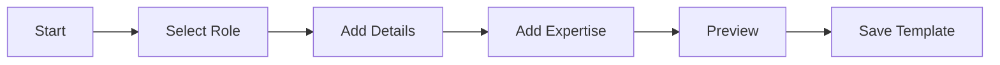

## State Management Flow

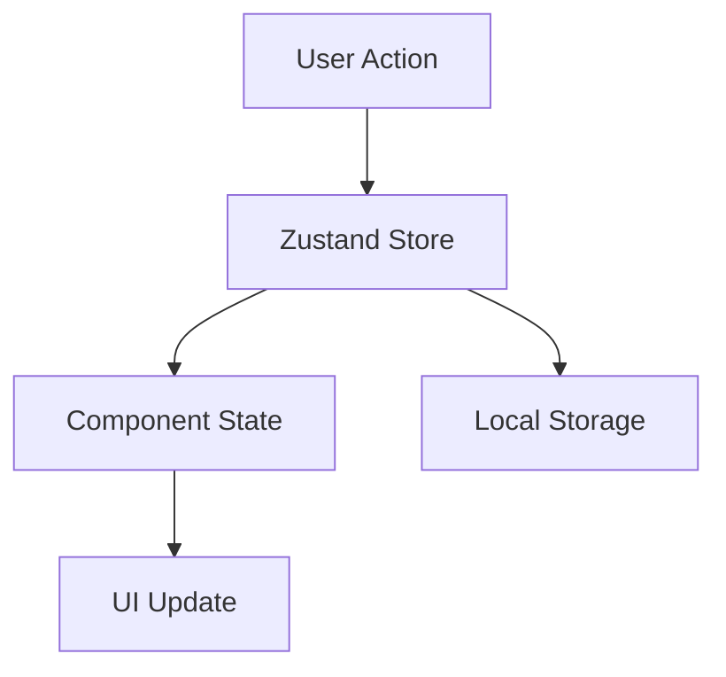

## Data Persistence Flow

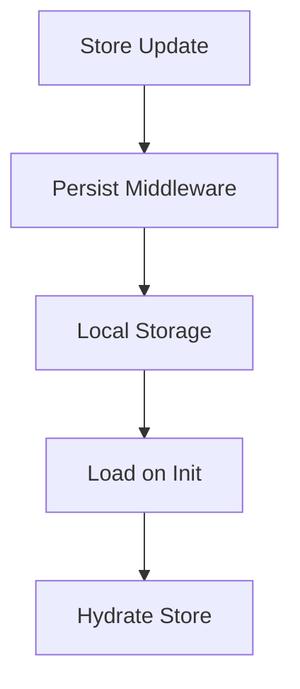

## Component Interaction Flow

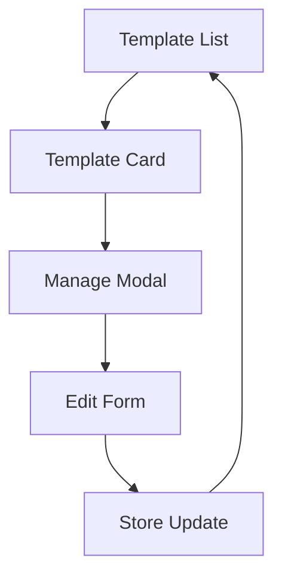

## Error Handling Flow

1. Permission Errors
   - Display appropriate error message
   - Log attempt
   - Maintain current state

2. Validation Errors
   - Show validation feedback
   - Preserve user input
   - Provide correction guidance

3. System Errors
   - Log error details
   - Show user-friendly message
   - Maintain data integrity

## Import/Export Flow

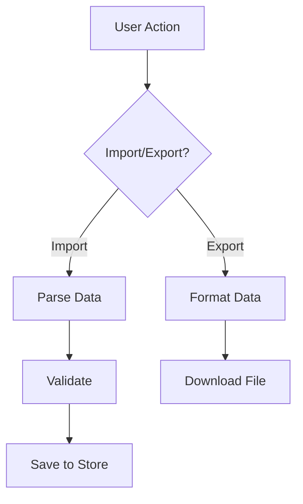

## API Integration Flow

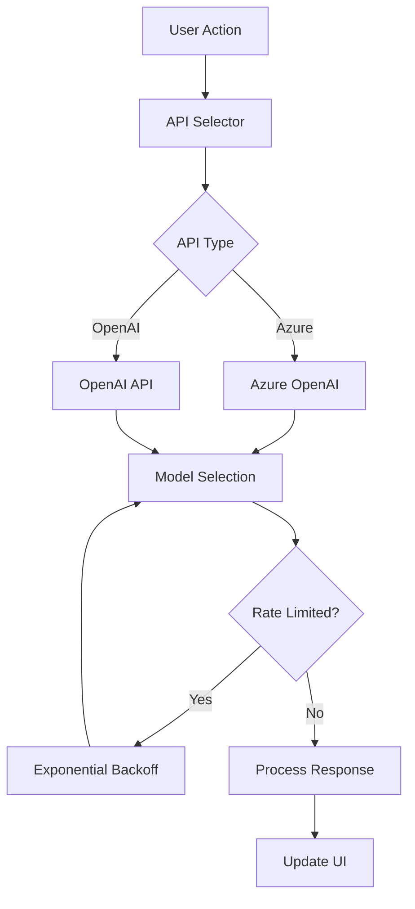

## Rate Limit Handling Flow

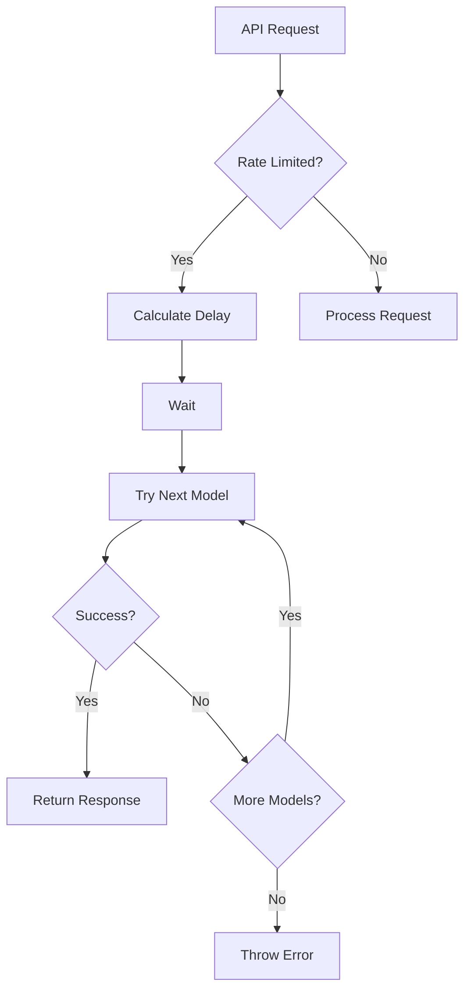

## Configuration Management Flow

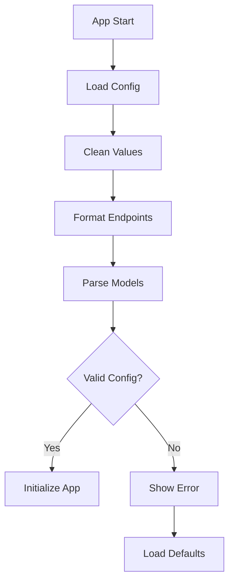

## Error Recovery Flow

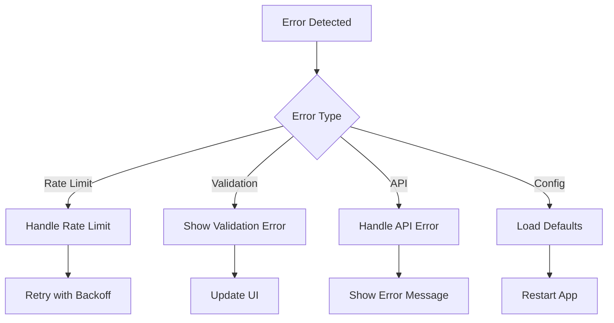

## Template Enhancement Flow

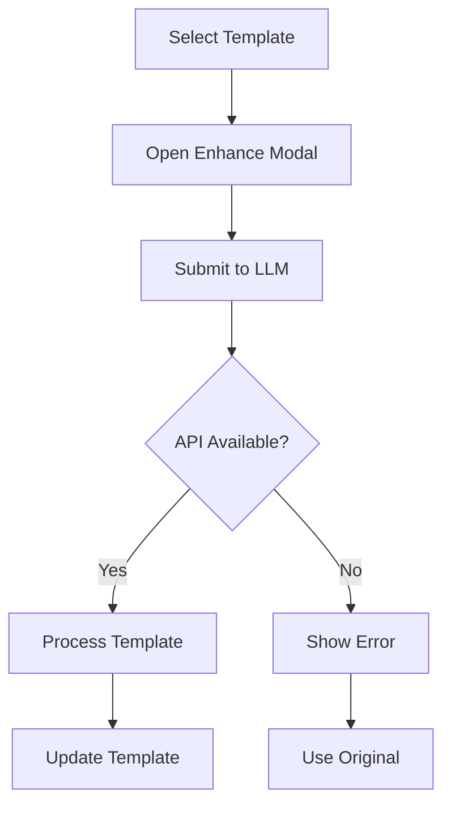

## Validation Flow

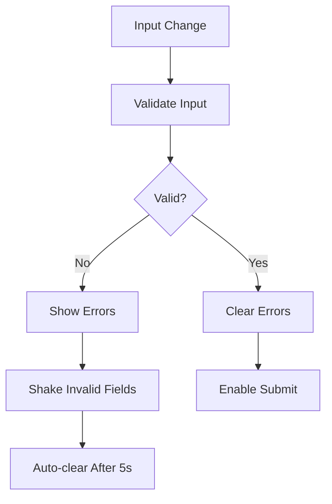
